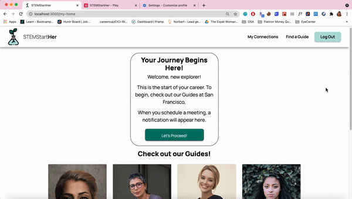

STEMStartHer
===

### Objectives
STEMStartHer is produced by a group of 8 women who came together in May of 2021 as part of the All-Women Global Virtual Hackathon hosted by The Expat Woman, where the theme was *Choose to Challenge*.

The gender gap in today's STEM workforce is still large, and we want to help bridge that gap. Even if you think you are interested in pursuing a STEM career, how do you know which path is right for you? It would be great to be able to turn to a group of women who are in STEM careers, but what if you don't know anyone to have these conversations with?

Our solution: A platform *for women by women*, an online space for any woman curious about a STEM career to find and speak with women who have real world experience in STEM careers, across the STEM spectrum.

Explorers can sign up and get suggested matches for Guides in the fields they are interested in, then book an Adventure (video call) with the Guide. The video call is integrated into the platform, so Explorers and Guides can meet with ease from any location they choose.

Guides can give back to the next generation of STEM women with the benefits of flexible meeting times and short time commitments.

## Technology Used

- Front-end: ReactJS
  - Libraries Used: 
    - React-bootstrap
    - react-select
    - react-router-dom 
- [Backend](https://github.com/mehmehmehlol/explorHer-backend): Ruby on Rails; database: PostgreSQL
- Figma to design the wireframe

## Installation

1. Clone this repository
```
git clone https://github.com/mehmehmehlol/explorHer-frontend.git
```
2. Install NPM packages
```
npm install
```
3. Run `npm start` to start "localhost:3000"

## Demo
<a href="https://www.youtube.com/watch?v=eYM6ZjpZGeY">Demo Video</a>
This 3-min demo video would show the entire prototype, including the wireframes that we didn't have the chance to develop throughout the hackathon.

If you prefer to see the rest of the undeveloped pages by yourself, our design team created this <a href="https://prototypehype.invisionapp.com/console/share/3V2JRZUUXZ>"interactive clickable prototype</a> (follow the blue areas)

## Screenshots

### Home


---

### Browser Tab


---

### Navbar

##### Navbar before Login


##### Navbar after Login


--- 

### footer


---

### For Explorers


---

### For Guide


---

### Multi-Step Sign Up Form


<br/>


<br />


<br />


---

### My Home Page (after log in/sign up)



---

### Find my Guide (available only after log in)


---

## Created By

- Full Stack Developer: [Megan Lo](https://github.com/mehmehmehlol)
- UI/UX Designer + Front-End Developer:
  - [Alyssa Benipayo](https://github.com/alyssabenipayo)
  - [Diane Geroy](https://github.com/dgeroy2)
  - [Lara Garrison](https://github.com/laragarrison)
- UI/UX Designer:
  - [Emma Li](https://github.com/EmmaLix2)
  - [Raylane Livingston](https://github.com/amaralraylane)
- Product Manager:
  - [Amy Chu](https://github.com/amy-chu)
  - [Elena Muntean](https://www.linkedin.com/in/elena-muntean-0a9a52165/)
